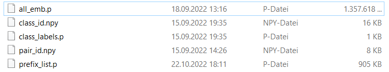

# How Robust are Audio Embeddings for Polyphonic Sound Classification?

## Reference

This jupyter notebook reproduces all experiments and figures for the article:

**Jakob Abeßer, Sascha Grollmisch, Meinard Müller, How Robust are Audio Embeddings for Polyphonic Sound Classification? (2022)**

## How to run

* download supplementary data from https://zenodo.org/record/7239506 and store files in the ```data``` subfolder, here's the list of required files:



* install [Miniconda](https://docs.conda.io/en/latest/miniconda.html) on your system

* create a new conda environment based on the provided requirements file
```
conda env create --file env.yml
```

* activate conda environment

```
activate emb_env
```

* run ```jupyter notebook``` 

* open ```article_reproduction.ipynb``` and run all cells

* result figures will be stored in ```results``` folder
